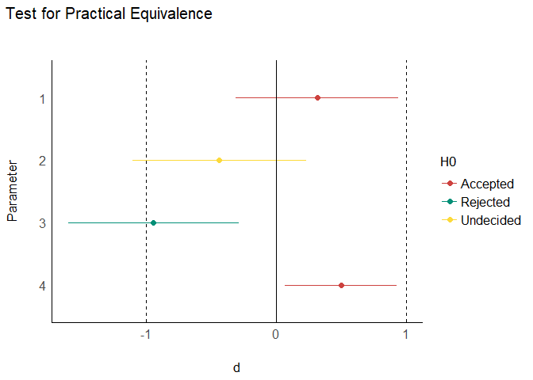
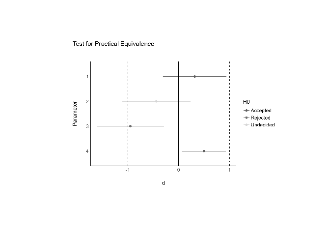
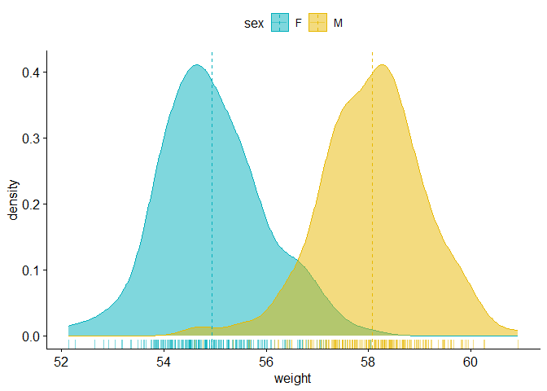
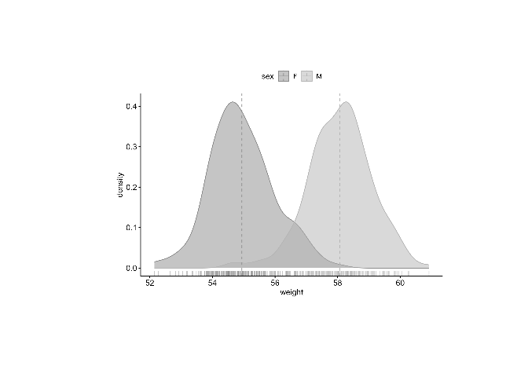
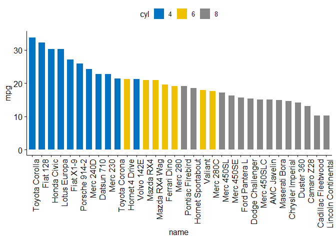
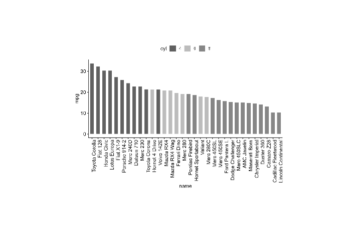

<!-- README.md is generated from README.Rmd. Please edit that file -->

# previewbw

A lot of plots are made while assuming that the audience will see the
plot in colors. However, articles are often printed in black and white
and these plots are thus unreadable.

The goal of `previewbw` is to show what a plot will look like if it’s
printed in black and white, so that the person who made the plot can
adapt it to be readable in black and white. The preview will be in lower
quality but that should still be enough to assess whether the plot is
readable.

## Installation

You can install the development version of previewbw like so:

``` r
devtools::install_github("etiennebacher/previewbw")
```

## Example

Here are a few examples coming from `ggpubr` and `see` (I don’t have
anything against these packages, they just provide a lot of examples
that I can use):

``` r
library(previewbw)
library(effectsize)
#> Warning: package 'effectsize' was built under R version 4.2.2
library(see)
library(ggpubr)
#> Loading required package: ggplot2
#> Warning: package 'ggplot2' was built under R version 4.2.2

t_to_d(t = c(1, -1.3, -3, 2.3), df_error = c(40, 35, 40, 85)) %>%
  equivalence_test(range = 1) %>%
  plot()
```



``` r

previewbw()
```



``` r
set.seed(1234)
wdata <- data.frame(
   sex = factor(rep(c("F", "M"), each=200)),
   weight = c(rnorm(200, 55), rnorm(200, 58)))

ggdensity(wdata, x = "weight",
   add = "mean", rug = TRUE,
   color = "sex", fill = "sex",
   palette = c("#00AFBB", "#E7B800"))
#> Warning: The dot-dot notation (`..density..`) was deprecated in ggplot2 3.4.0.
#> ℹ Please use `after_stat(density)` instead.
#> ℹ The deprecated feature was likely used in the ggpubr package.
#>   Please report the issue at <]8;;https://github.com/kassambara/ggpubr/issueshttps://github.com/kassambara/ggpubr/issues]8;;>.
```



``` r

previewbw()
```



``` r
data("mtcars")
dfm <- mtcars
dfm$cyl <- as.factor(dfm$cyl)
dfm$name <- rownames(dfm)

ggbarplot(dfm, x = "name", y = "mpg",
          fill = "cyl",              
          color = "white",            
          palette = "jco",            
          sort.val = "desc",          
          sort.by.groups = FALSE,     
          x.text.angle = 90          
          )
```



``` r

previewbw()
```


